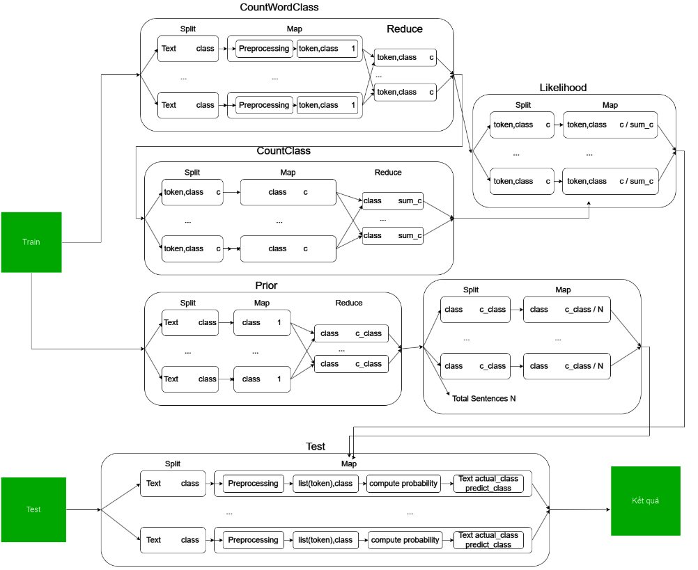

### Naive Bayes Classifer
- Link bộ dữ liệu, thư viện sử dụng trong code, file jar được buid sẵn: [Link](https://drive.google.com/drive/folders/1sLJ6s0fKA4BZXDSFNkeVp8AzWEPQGufS?usp=drive_link) 
- Link ảnh, video demo: [Link](https://drive.google.com/drive/folders/1iUgsEYHMDoR_udNACCFmdAFS6GZZ2LvR?usp=drive_link)

## Giới thiệu:
- Các tài liệu liên có trong dự án, bao gồm:
    + Source code (tệp src):
        * Trong src, class chính là NaiveBayes.class.
    + Các tài liệu khác, file jar được build sẵn được đặt trong 2 đường link bên trên.
## Chạy:
- Có thể sử dụng file jar có sẵn hoặc tự build.
- Chạy lệnh: hadoop jar `<file.jar>` `<Train.txt>` `<Test.txt>` `<List of classes>` `<ouput>` `<optional: true or false, default = true>`
    - optional: có sử dụng evaluate hay không, mặc định là có sử dụng. Chỉ không sử dụng khi thực hiện inference.
    - List of classes: danh sách tất cả các lớp để phân loại có trong bộ dữ liệu
- Vd: `hadoop` `jar` `NaiveBayesClassifer.jar` `ExampleTrain.txt` `ExampleTest.txt` `"0,1"` `output`
- Kết quả có dạng: `Text` `<tab>` `class1:probability1`,`class2:probability2`,...
- Lưu ý về file Train, Test:
    + file Train: mỗi dòng là 1 cặp Text, class, cách nhau bởi dấu `<tab>`
    + file Test: mỗi dòng là Text.
## Luồng hoạt động hệ thống:

## Pipeline data:

## Các phiên bản kèm theo:
- Java 11 (openjdk 11.0.22 2024-01-16)
- Hadoop 3.4.0.
- CoreNLP 4.5.7.
- Khi build, sử dụng 2 thư viện trên đã được đặt ở link.
